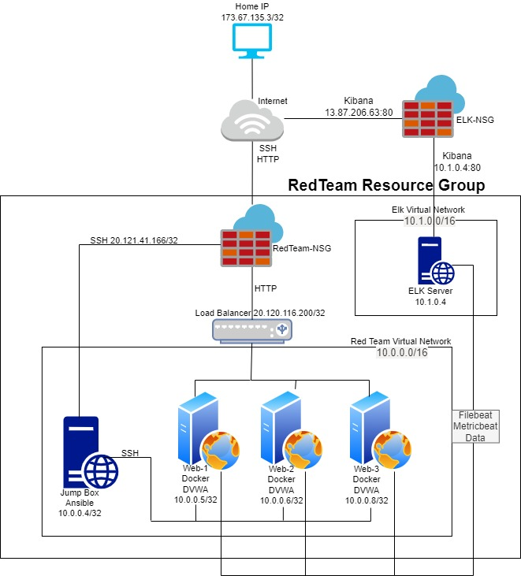

# Project1-Week13
UPenn Cybersecurity Project 1

Automated ELK Stack Deployment

The files in this repository were used to configure the network depicted below.

diagrams/Project-Diagram.jpg

These files have been tested and used to generate a live ELK deployment on Azure. They can be used to either recreate the entire deployment pictured above. Alternatively, select portions of the playbook (YAML) file may be used to install only certain pieces of it, such as Filebeat.

  - install-elk.yml
  - filebeat-playbook.yml
  - metricbeat-playbook.yml

This document contains the following details:
- Description of the Topology
- Access Policies
- ELK Configuration
  - Beats in Use
  - Machines Being Monitored
- How to Use the Ansible Build

### Description of the Topology

The main purpose of this network is to expose a load-balanced and monitored instance of DVWA, the D*mn Vulnerable Web Application.

Load balancing ensures that the application will be highly available, in addition to restricting access to the network.
- A load balancer helps prevent a single server from becoming overloaded by distributing traffic among multiple web servers. 
- The advantage of a jump box is to limit the number of publicly accessible inbound management connections to a single box. 

Integrating an ELK server allows users to easily monitor the vulnerable VMs for changes to the Log files and system traffic.
- Filebeat monitors the log files or locations that you specify, collects log events, and forwards them either to Elasticsearch or Logstash for indexing
- Metricbeat takes the metrics and statistics that it collects and ships them to the output that you specify, such as Elasticsearch or Logstash. Metricbeat helps you monitor your servers by collecting metrics from the system and services running on the server, such as: Apache.

The configuration details of each machine may be found below.

| Name     | Function | IP Address | Operating System |
|----------|----------|------------|------------------|
| RedJumpboxProvisioner | Gateway  | 10.0.0.4   | Linux            |
| Web-1    | webserver| 10.0.0.5   | Linux            |
| Web-2    | webserver| 10.0.0.6   | Linux            |
| Web-3    | webserver| 10.0.0.8   | Linux            |
| Elk-1    | monitoring| 10.1.0.4  | Linux            |

### Access Policies

The machines on the internal network are not exposed to the public Internet. 

Only the RedJumpboxProvisioner machine can accept connections from the Internet. Access to this machine is only allowed from the following IP addresses:
- 173.67.135.3

Machines within the network can only be accessed by the Ansible Container running on the RedJumpboxProvisioner.
- RedJumpboxProvisioner
- 10.0.0.4

A summary of the access policies in place can be found in the table below.

| Name     | Publicly Accessible | Allowed IP Addresses |
|----------|---------------------|----------------------|
| RedJumpboxProvisioner | Yes                 | 173.67.135.3    |
| Web-1     | No                 |  10.0.0.4                    |
| Web-2     | No                 |  10.0.0.4             |
| Web-3     | No                 |  10.0.0.4             |
| Elk-1     | No                 |  10.0.0.4             |
| GoForRed-LB | Yes                 | 173.67.135.3    |

### Elk Configuration

Ansible was used to automate configuration of the ELK machine. No configuration was performed manually, which is advantageous because...
- A single or Thousands of VM's can be deployed quickly
- Manual configurations allow for potential errors during deployment. Automated deployments are tested for errors before being deployed.

The playbook implements the following tasks:
- Sets the remote user used to deploy the ELK Stack
- Installs docker.io
- Installs pip3
- Downloads, lauches, and configures a docker elk container
- Starts the docker service 

The following screenshot displays the result of running `docker ps` after successfully configuring the ELK instance.

### Target Machines & Beats
This ELK server is configured to monitor the following machines:
- 10.0.0.5
- 10.0.0.6
- 10.0.0.8

We have installed the following Beats on these machines:
- Filebeat
- Metricbeat

These Beats allow us to collect the following information from each machine:
- Filebeat monitors the log files or locations that you specify, collects log events, and forwards them either to ELK
- Metricbeat takes the metrics and statistics that it collects and ships them to ELK. Metricbeat helps you monitor your servers by collecting metrics from the system and services running on the server, such as: Apache.

### Using the Playbook
In order to use the playbook, you will need to have an Ansible control node already configured. Assuming you have such a control node provisioned: 

SSH into the control node and follow the steps below:
- Copy the Playbook file to Ansible.
- Update the hosts file to include the Webservers IP Addresses and ELKServer IP to their appropriate groups. 
- Run the playbook, and navigate to Kibana URL to check that the installation worked as expected.

- Install-ELK.yml is the playbook file.  It is copied to the /etc/ansible directory to run
- You update the hosts file to identify the server(s) to run the playbook on. You will reference which group (located in the hotsts file) to run the playbook on within the YML file.  You will point to the Webservers group to install filebeat and metricbeat on and the ELKServers group to install the ELK services.
- To check that my ELK server is running, I navigate to http://13.87.206.63:5601/app/kibana

_As a **Bonus**, provide the specific commands the user will need to run to download the playbook, update the files, etc._

- Become root user: sudo su
- Navigate to ansible directory: cd /etc/ansible
- Edit the ansible config: nano ansible.cfg
- Set your azure VM username: remote_user = azureuser
- Save the config file: ctrl-x,  Y to save, Enter to save as the ansible.cfg filename
- Edit the hosts file: nano hosts
- Add the webserver IPs followed by ansible_python_interpreter=/usr/bin/python3 to the hosts file under [Webservers] Group
- Add the ELK Server IP followed by ansible_python_interpreter=/usr/bin/python3 under [ELKServers] group
- Save the hosts file: ctrl-x,  Y to save, Enter to save as the hosts filename
- Make sure you are in the directory that install-elk.yml is in: cd /etc/ansible
- Edit install-elk.yml: nano install-elk.yml
- Make sure the install-elk.yml file matches the one attached to this repository
- Save the yml file: ctrl-x,  Y to save, Enter to save as the install-elk.yml filename
- Install ELK using playbook: ansible-playbook install-elk.yml
- Edit the filebeat-config.yml and metricbeat-config.yml files to point to your ELK Stack 
- nano filebeat-config.yml
- nano metricbeat-config.yml
- Save the two files: ctrl-x,  Y to save, Enter to save as the appropriate filename
- Create the two playbooks 
- nano filebeat-playbook.yml
- nano metricbeat-playbook.yml
- Make sure they are configured like the two attached files in the repository
- Save the two files: ctrl-x,  Y to save, Enter to save as the appropriate filename
- Run the playbooks
- ansible-playbook filebeat-playbook.yml
- ansible-playbook metricbeat-playbook.yml
- Confirm that they are both sending data to ELK. 
- Connect to Kibana : http://13.87.206.63:5601/app/kibana
- Click Add Log Data
- Click System Logs
- Scroll to bottom and click Check data.  Make sure "Data successfully received from this module" is shown
- Back up to Add Data to kibana. Click on the Metrics Tab.  Click Docker Metrics. Scroll to bottom and click Check data.
- Make sure "Data successfully received from this module" is shown
